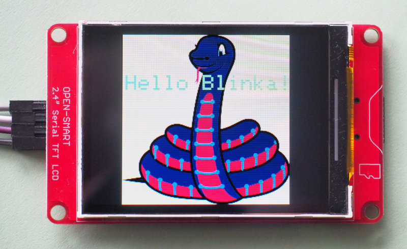

CircuitPython-Driver for Open-Smart Serial-TFT
=============================================

This a CircuitPython-Driver for the Open-Smart Serial-TFT
<https://de.aliexpress.com/item/32875189295.html>.

Note that the driver does not use any specific CircuitPython methods,
so it will also work with CPython (tested) and MicroPython
(untested). The provided examples need to be adapted for MicroPython.

Hardware
--------

The display is a 320x240 2.4" display with UART interface. The main
selling points are:

  - only two pins (RX, TX) are needed besides VCC and GND
  - supports 5V and 3V3
  - simple API
  - works even with memory contrained systems (e.g. SAMD21)
  - integrated SD-card slot for images

Internally, the device uses an ATmega328PB with an ILI9325.

Installation
------------

Copy the driver module `serial_tft` to your device.

Usage
-----

There are two versions of the driver. One is a fat version that internally
keeps state and is easier to maintain, one is a slim version optimized
for memory constraint systems (tested with the Trinket-M0).

The `examples` subdirectory has a few examples that demonstrate the API-usage.
All examples exist in two versions for the fat and the slim version.

Notes
-----

The driver does not implement the full API, since some of the API-calls
don't make sense in the context of Python.

There is also a touch-enabled version of the display. Adding support for
touch is simple, but would need a device to test.

It is possible to flash a custom firmware to the integrated ATmega328PB.
Open-Smart sells a suitable test-fixture for this purpose.

The firmware is not open source, but judging from the API, it is only a
thin UART-wrapper around the Adafruit_GFX library.